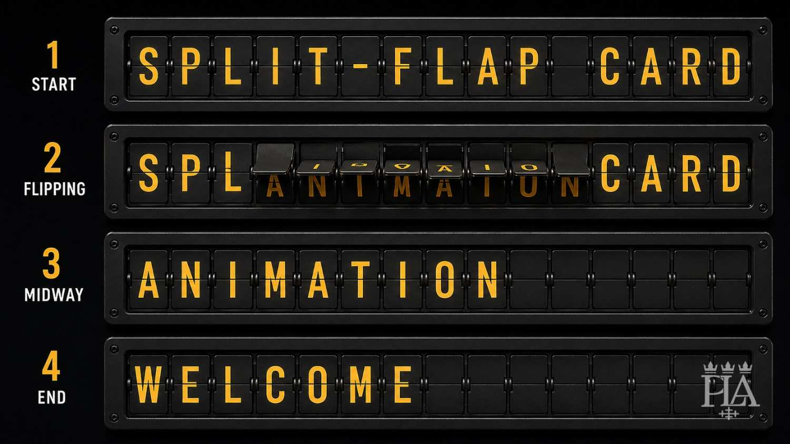
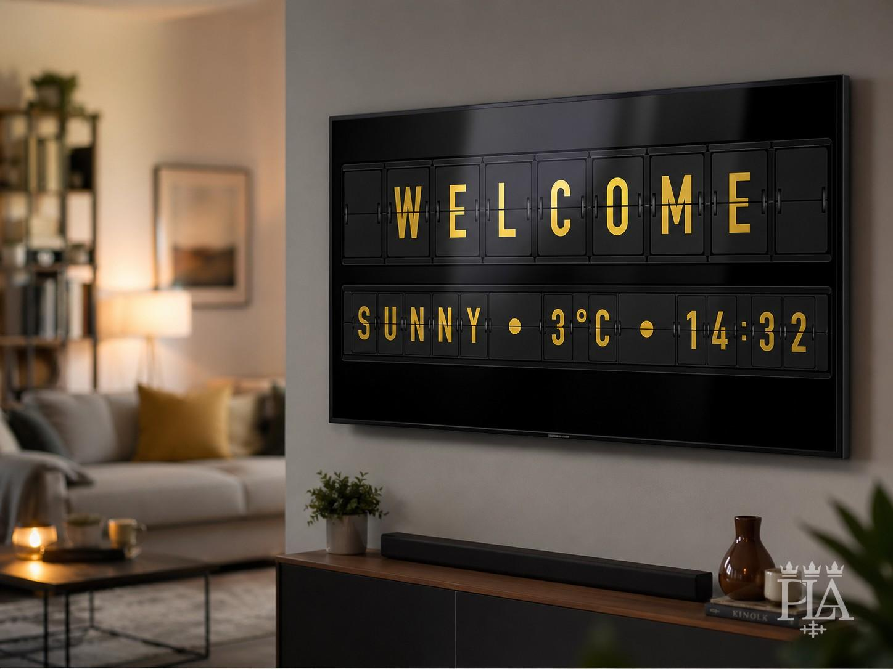
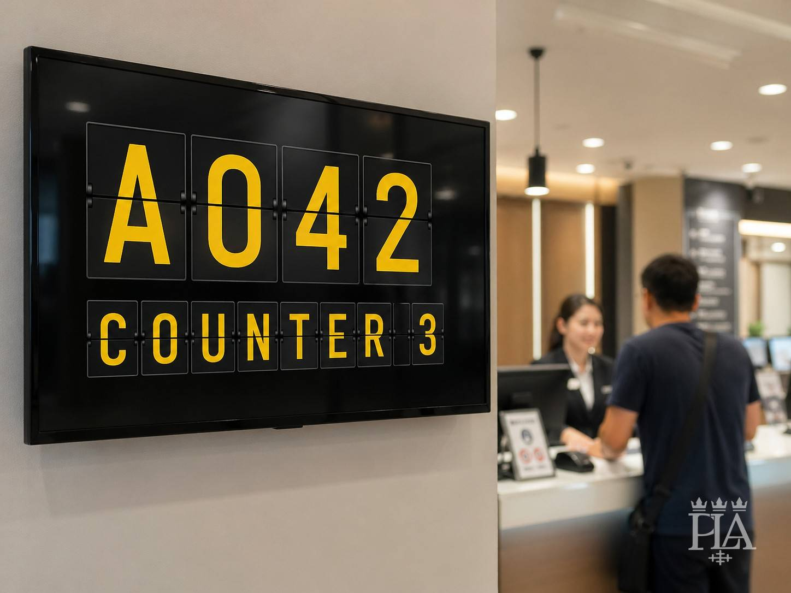

# Split-Flap Card for Home Assistant



## Notice

This project is currently in alpha.

The configuration API may change before `v1.0.0`.

## Project context

Standing design and update context is documented in:

[Standing Context](./docs/STANDING_CONTEXT.md)

Release changes are documented in:

[Changelog](./CHANGELOG.md)

## Preview examples

<p align="center">
  
</p>

<p align="center">
  
</p>

<p align="center">
  
</p>


## Overview

Split-Flap Card is a Home Assistant Lovelace custom card that renders static text, entity states, entity attributes and a browser-based clock as a mechanical split-flap display.

## Current alpha features

- Static text
- Entity state
- Entity attribute
- Browser clock mode
- Basic visual editor
- Mechanical split-flap animation
- `segments` and `max_chars`
- Swedish charset support with `Å`, `Ä`, `Ö`
- Nordic charset support
- Western European charset support
- Weather charset support with `°`
- Extended charset preset
- Custom charset
- Configurable colors
- Configurable segment size
- Configurable font family and size
- Built-in themes:
  - `kiosk_gold`
  - `mechanical_gold`
  - `classic_airport`
  - `terminal_amber`
  - `monochrome`
- HACS-compatible dashboard plugin structure

## Not included yet

- Auto-paging
- MDI icon token rendering
- Advanced visual editor layout
- Google Font loader
- Custom font URL loader
- Advanced flip modes such as `shortest` and `direct`


## Installation

### HACS custom repository

1. Open **HACS**.
2. Open **Custom repositories**.
3. Add this repository:

```text
https://github.com/ph13t0n/ha-split-flap-card
```

4. Select category:

```text
Dashboard
```

5. Click **Add**.
6. Install **Split-Flap Card**.
7. Refresh your browser.

Expected HACS resource:

```yaml
url: /hacsfiles/ha-split-flap-card/ha-split-flap-card.js
type: module
```

## Optional support

This is a hobby project built while learning more about Home Assistant, smart homes, code, and dashboards.

If you find it useful and want to support continued development, you can leave a small tip on Ko-fi:

[](https://ko-fi.com/lifarvidsson)


## Basic usage

```yaml
type: custom:split-flap-card
text: CENTRAL STATION
segments: 16
theme: kiosk_gold
```

## Mechanical gold example

```yaml
type: custom:split-flap-card
text: SPLIT-FLAP CARD
segments: 16
theme: mechanical_gold
animation: true
initial_animation: true
cycle_chars: true
cycle_count: 2
flip_duration: 640
flip_stagger: 35
```

## Swedish example

```yaml
type: custom:split-flap-card
text: NÄSSJÖ CENTRAL
language: sv
charset: sv
segments: 14
theme: mechanical_gold
```

## Entity example

```yaml
type: custom:split-flap-card
source: entity
entity: input_text.split_flap_message
language: sv
charset: sv
segments: 24
theme: kiosk_gold
```

## Attribute example

```yaml
type: custom:split-flap-card
source: entity
entity: weather.home
attribute: temperature
charset: weather
segments: 6
theme: kiosk_gold
```

## Clock example

```yaml
type: custom:split-flap-card
source: clock
clock_format: HH:mm:ss
clock_tick_interval: 1000
charset: custom
custom_charset: " 0123456789:"
segments: 8
theme: mechanical_gold
cycle_chars: false
```

## Configuration

| Option | Type | Default | Description |
|---|---:|---|---|
| `source` | string | inferred | `text`, `entity`, or `clock` |
| `text` | string | — | Static text to display |
| `entity` | string | — | Entity state to display |
| `attribute` | string | — | Entity attribute to display |
| `clock_format` | string | `HH:mm` | Clock format using `HH`, `H`, `mm`, `ss` |
| `clock_tick_interval` | number | `1000` | Clock update interval in milliseconds |
| `language` | string | `en` | Language hint |
| `charset` | string | language value | `en`, `sv`, `nordic`, `western`, `weather`, `weather_sv`, `extended`, `custom` |
| `custom_charset` | string | — | Custom charset when using `charset: custom` |
| `text_transform` | string | `uppercase` | `uppercase`, `lowercase`, or unchanged |
| `fallback_character` | string | space | Character used when input is unsupported |
| `pad_character` | string | space | Character used to pad empty segments |
| `pad_mode` | string | `end` | `start` or `end` |
| `segments` | number | text length | Number of displayed segments |
| `max_chars` | number | — | Legacy alias for `segments` |
| `max_segments` | number | `96` | Safety limit for segment count |
| `theme` | string | `classic` | Built-in theme |
| `align` | string | `center` | `left`, `center`, or `right` |
| `animation` | boolean | `true` | Enable split-flap animation |
| `initial_animation` | boolean | `true` | Animate from blank on first render |
| `cycle_chars` | boolean | `true` | Show intermediate characters |
| `cycle_count` | number | `2` | Number of intermediate characters |
| `flip_duration` | number | `520` | Flip duration in ms |
| `flip_stagger` | number | `45` | Delay between segment flips in ms |

## Security

This is a frontend-only dashboard card.

It does not:

- Store credentials
- Call external APIs
- Require Home Assistant long-lived access tokens
- Modify Home Assistant configuration
- Create entities or services

Avoid sharing screenshots or YAML containing private entity names, tokens, addresses or private URLs.

## Reporting issues

When reporting an issue, include:

- Home Assistant version
- HACS version
- Browser/device
- Installation method
- Full YAML configuration
- Screenshot or screen recording
- Browser console errors

## License

This project is licensed under the MIT License.

Copyright © 2026 Per Lif Arvidsson (ph13t0n).

See [LICENSE](./LICENSE) for details.

## Commercial support

This project is open source under the MIT License.

Commercial support, custom development, branding, theme adaptation and implementation assistance may be offered separately by agreement.

For business inquiries, contact [hej@lifarvidsson.se](mailto:hej@lifarvidsson.se?subject=Business%20inquiry) with the subject line `Business inquiry`.
