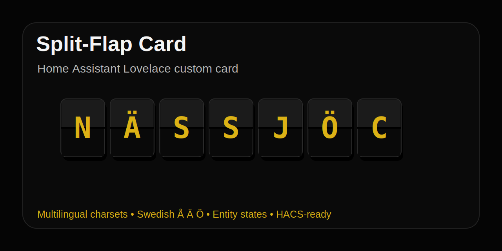

# ha-split-flap-card



A Home Assistant Lovelace custom card that renders text or entity states as a classic split-flap display, inspired by railway and airport departure boards.

Supports multilingual charsets, including Swedish Å, Ä and Ö.
## Features

- Display static text
- Display Home Assistant entity states
- Display entity attributes
- Classic split-flap visual style
- Built-in charset presets
- English default charset
- Swedish charset support with Å, Ä and Ö
- Nordic charset support
- Custom charset support
- Configurable colors
- Configurable font family
- Configurable segment size
- Configurable font size
- HACS-compatible dashboard plugin structure

## Installation

### HACS custom repository

1. Open HACS in Home Assistant.
2. Go to **Custom repositories**.
3. Add this repository.
4. Select category **Dashboard**.
5. Install **Split-Flap Card**.
6. Refresh your browser.
7. Add the card to your dashboard.

### Manual installation

Download `ha-split-flap-card.js` and place it in:

```text
/config/www/ha-split-flap-card.js
